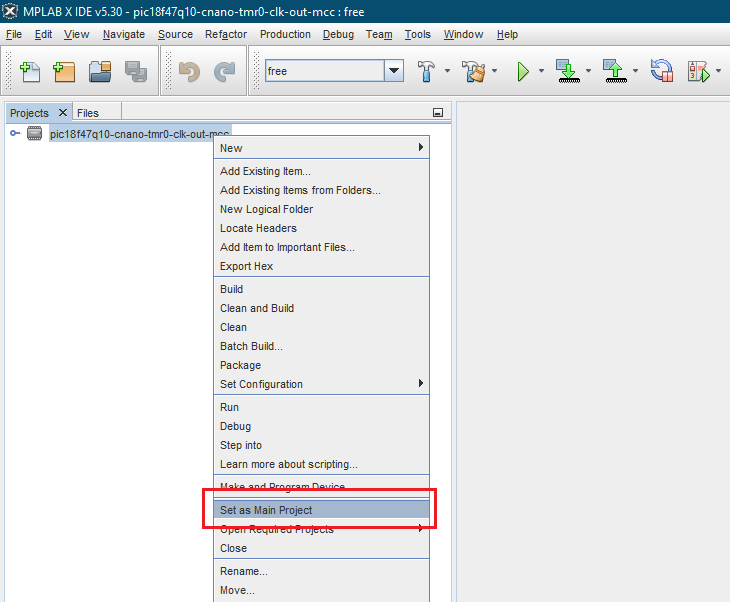
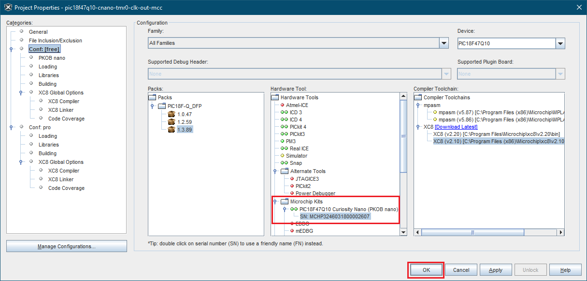
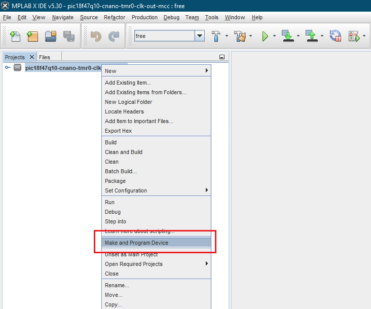
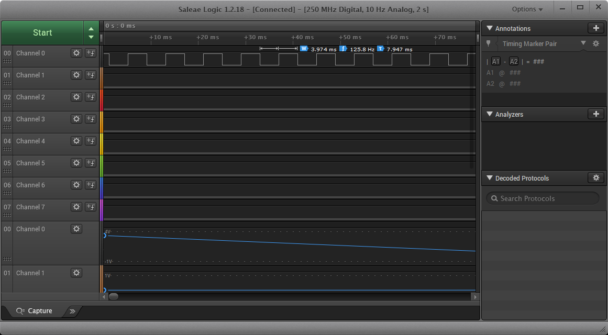

 <article class="markdown-body entry-content p-3 p-md-6" itemprop="This needs to locked down and 'never' changed">

# PIC18F47Q10 Using TMR0 in 8-bit Mode and to Generate an Output Signal

## Objective:
This repository contains an example of MCC-generated source code for TMR0 as described in [*TBxxxx - Getting Started with Timers/Counters on PIC18*](https://www.microchip.com/) document from Microchip.

<be>This example describes how to configure TMR0 in 8-bit mode, using LFINTOSC as clock source.
 A GPIO pin will be configured as output and a 125 Hz signal will be generated on the GPIO pin using the Peripheral Pin Select (PPS).
 The code was generated using MPLAB Code Configurator.

## Related Documentation
- [TBxxxx - Getting Started with Timers/Counters on PIC18](http://www.microchip.com/)
- [PIC18-Q10 Product Family Page](https://www.microchip.com/design-centers/8-bit/pic-mcus/device-selection/pic18f-q10-product-family)
- [PIC18F47Q10 Data Sheet](http://ww1.microchip.com/downloads/en/DeviceDoc/40002043D.pdf)
- [PIC18F47Q10 Code Examples on GitHub](https://github.com/microchip-pic-avr-examples?q=pic18f47q10-cnano&type=&language=)

## Software Used
- MPLAB® X IDE 5.30 or newer [(microchip.com/mplab/mplab-x-ide)](http://www.microchip.com/mplab/mplab-x-ide)
- MPLAB® XC8 2.10 or newer [(microchip.com/mplab/compilers)](http://www.microchip.com/mplab/compilers)
- MPLAB® Code Configurator (MCC) 3.95.0 or newer [(microchip.com/mplab/mplab-code-configurator)](https://www.microchip.com/mplab/mplab-code-configurator)
- MPLAB® Code Configurator (MCC) Device Libraries PIC10 / PIC12 / PIC16 / PIC18 MCUs 1.79.0 or newer [(microchip.com/mplab/mplab-code-configurator)](https://www.microchip.com/mplab/mplab-code-configurator)
- Microchip PIC18F-Q Series Device Support 1.3.89 or newer [(packs.download.microchip.com/)](https://packs.download.microchip.com/)

## Hardware Used
- PIC18F47Q10 Curiosity Nano [(DM182029)](https://www.microchip.com/Developmenttools/ProductDetails/DM182029)

## Setup
The PIC18F47Q10 Curiosity Nano Development Board is used as the test platform.

 

The following configurations must be made for this project:
- Clock
	- Oscillator Select: HFINTOSC
	- HF Internal Clock: 1 MHz
	- Clock Divider: 1
- TMR0
	- TMR0 Enabled
	- Clock Prescaler: 1:1
	- Postscaler: 1:1
	- Timer mode: 8-bit
	- Clock Source: LFINTOSC
	- Synchronization: disabled
	- Timer interrupt: enabled
- Watchdog Timer: disabled

|Pin           | Configuration      |
| :----------: | :----------------: |
|RC2           | Digital Output     |

## Operation
1. Connect the board to the PC.

2. Open the *pic18f47q10-cnano-tmr0-clk-out-mcc.X* project in MPLAB® X IDE.

3. Set *pic18f47q10-cnano-tmr0-clk-out-mcc* project as main project. Right click on the project in the *Projects* tab and click *Set as Main Project*:
 

4. Select the *PIC18F47Q10 Curiosity Nano* in the *Hardware Tool* section of the project settings:
  - Right click on the project and click *Properties*;
  - Select the *PIC18F47Q10 Curiosity Nano* (click on the SN) in the *Hardware Tool* tab and then click *OK*:
 

5. Program the project to the board: right click on the project and click *Make and Program Device*:
 

Demo:

 

## Summary

This project is an illustration for a basic use case based around TMR0.
